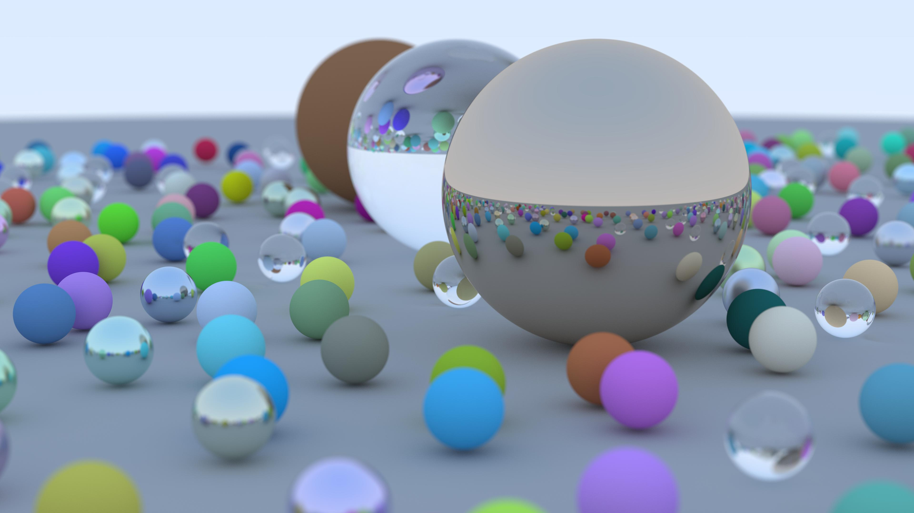
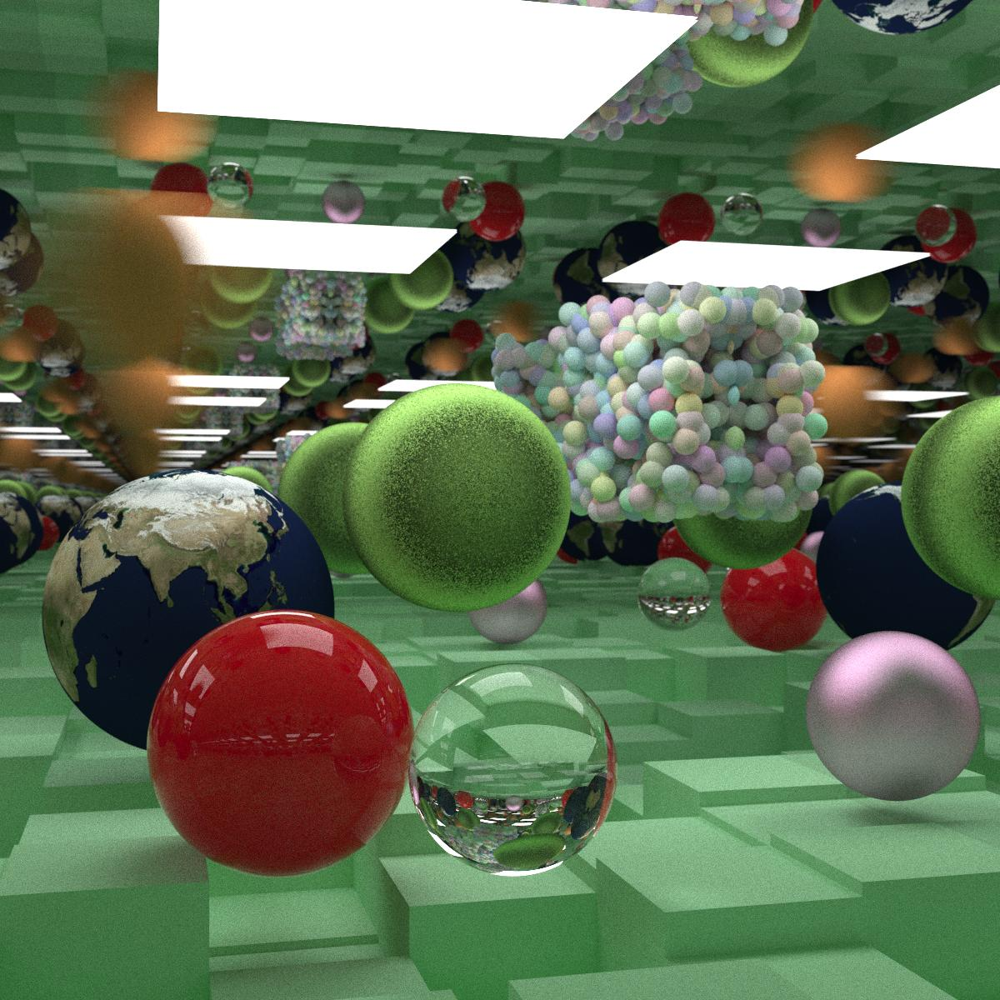
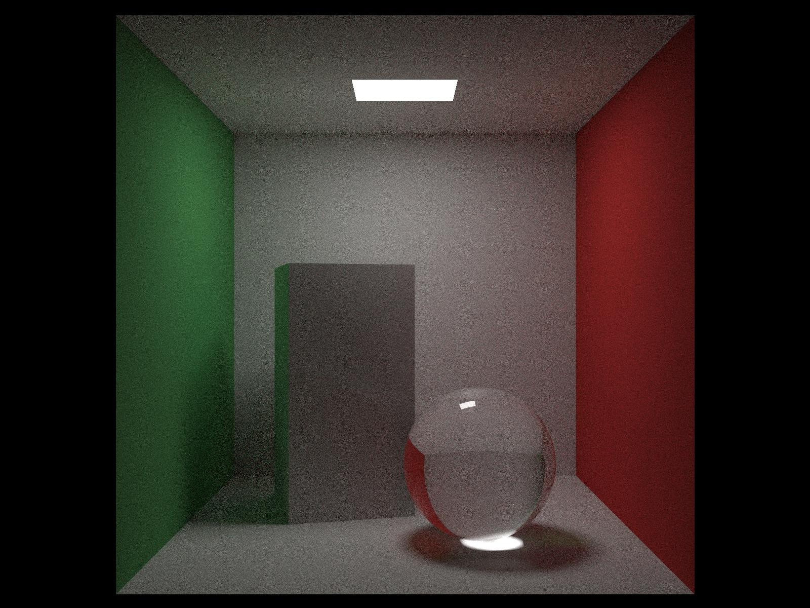

# RayTracingInOneWeekendChaptByChapt

RayTracingInOneWeekend, coding it myself Chapter By Chapter
with the book series:

https://github.com/RayTracing/raytracing.github.io

https://raytracing.github.io/books/RayTracingInOneWeekend.html

https://raytracing.github.io/books/RayTracingTheNextWeek.html

https://raytracing.github.io/books/RayTracingTheRestOfYourLife.html

# 
-------------------------------------------------------------------------------------------------------------------------------------------------------------------------------

<!--
-->

### 
Book 1 Final Result : 3840x2160, 500 Samples per Pixel

# 
-------------------------------------------------------------------------------------------------------------------------------------------------------------------------------

<!--
-->

### 
Book 2 Final Result : 1200 × 1200, 500 Samples per Pixel

# 
-------------------------------------------------------------------------------------------------------------------------------------------------------------------------------

<!--
-->

### 
Book 3 Final Result : 1600x1200, 3000 Samples per Pixel

# 
-------------------------------------------------------------------------------------------------------------------------------------------------------------------------------

