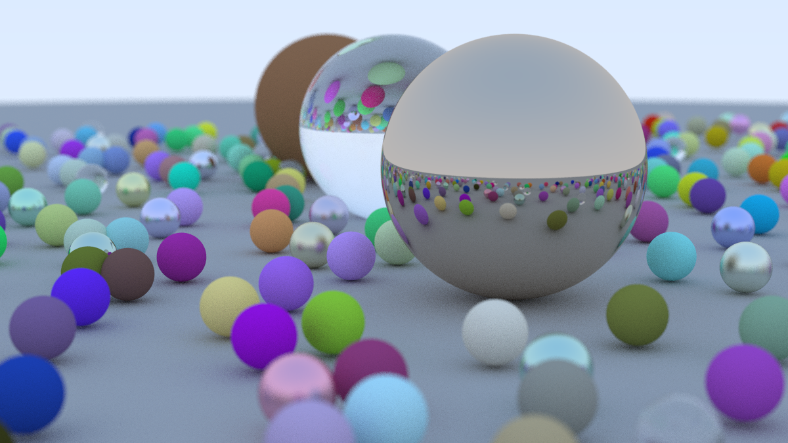

# RayTracingInOneWeekendChaptByChapt

RayTracingInOneWeekend, coding it myself Chapter By Chapter
with the book series:

https://github.com/RayTracing/raytracing.github.io

https://raytracing.github.io/v3/index.html

https://raytracing.github.io/v3/books/RayTracingInOneWeekend.html

https://raytracing.github.io/v3/books/RayTracingTheNextWeek.html

https://raytracing.github.io/v3/books/RayTracingTheRestOfYourLife.html

#←↑→↓↖↗↘↙ 
-------------------------------------------------------------------------------------------------------------------------------------------------------------------------------
## 
Book 1 : Ray Tracing in One Weekend

<!---->

#### 
 02_Output_PPM-02.png, 256x256 Pixels

### 
↑Book 1 : Chapter 2 : Output an Image↑

#### 
04_Add_Rays.png, 400x225 Pixels

### 
↑Book 1 : Chapter 4 : Rays, a Simple Camera, and Background↑

#### 
05_Adding_a_Sphere.png" width="700" align="middle"/> 400x225 Pixels

### 
↑Book 1 : Chapter 5 : Adding a Sphere↑

#### 
06_Surface_Normals_and_Multiple_Objects_04_Listing24_Image5.png, 400x225 Pixels

### 
↑Book 1 : Chapter 6↑

#### 
07_Antialiasing_02_spp=100.png, 400x225 Pixels

### 
↑Book 1 : Chapter 7↑

#### 
08_Diffuse_Materials_07_Image10.png, 400x225 Pixels

### 
↑Book 1 : Chapter 8↑

#### 
09_Metal_Image_12：Fuzzed_metal_ground_1.png, 400x225 Pixels

### 
↑Book 1 : Chapter 9↑

#### 
10_Dielectrics-Glass_Image_16.png, 400x225 Pixels

### 
↑Book 1 : Chapter 10↑

#### 
11_Positionable_Camera/11_Camera_03_Image19_Zooming_in.png, 400x225 Pixels

### 
↑Book 1 : Chapter 11↑

#### 
12_Defocus_Blur_11-Image_20.png, 400x225 Pixels

### 
↑Book 1 : Chapter 12↑

<!---->
#### 
13_Final_Render_12_Srand_06_Samples_100_Image_04.png, 1200x675 Pixels, 100 Samples per Pixel

### 
↑Book 1 : Chapter 13, Final Result : ↑

# 
-------------------------------------------------------------------------------------------------------------------------------------------------------------------------------

## 
Book 2 : Ray Tracing: The Next Week

#### 
 02_Motion_Blur_Release_not_using_bvh_in_main.jpg

### 
↑Book 2 : Chapter 2,  Motion Blur↑

#### 
 still balls with red background using bvh

#### 
 still balls with green background using bvh

#### 
time cost comparing before and after using bvh

### 
↑Book 2 : Chapter 3, Bounding Volume Hierarchies↑

#### 
04_Solid_Textures_02_Image_2_Spheres_on_checkered_ground.jpg

#### 
04_Solid_Textures_03_Listing_28_Second_scene-Image_3-Checkered_spheres.jpg

### 
↑Book 2 : Chapter 4, Solid Textures↑

#### 
Image 6: Tiled random patterns

#### 
Image 7: Hashed random texture

#### 
Image 8: Perlin texture with trilinear interpolation

#### 
Image 9: Perlin texture, trilinearly interpolated, smoothed

#### 
Image 10: Perlin texture, higher frequency

#### 
Image 11: Perlin texture, shifted off integer values

#### 
Image 12: Perlin texture with turbulence

#### 
Image 13: Perlin noise, marbled texture

#### 

#### 

#### 
comparing before_and_after_using_Hermite_cubic

### 
↑Book 2 : Chapter 5, Perlin Noise↑

#### 
06_Image_Texture_Earth-Mapped_Sphere_01_960x540.jpg

### 
↑Book 2 : Chapter 6, Image Texture Mapping↑

#### 
Image 16: Scene with rectangle light source

#### 
Image 17: Scene with rectangle and sphere light sources

#### 
Image 18: Empty Cornell box
### 
↑Book 2 : Chapter 7, Rectangles and Lights↑

#### 
Image 19: Cornell box with two blocks, spp=500

#### 
Image 20: Standard Cornell box scene, spp=500

### 
↑Book 2 : Chapter 8, Instances↑

#### 
Image 21: Cornell box with blocks of smoke

#### 
09_Volumes_05_Tall_Orange_and_Short_Pink_Light_Value=7.jpg

### 
↑Book 2 : Chapter 9, Volumes↑

#### 
10_Final_Scene_01_perlin_scale=0.2.jpg

#### 
10_Final_Scene_04_more_colorful_and_make_things_moving.jpg

#### 
10_Final_Scene_09_Image_22_Final_scene_03_adding_fog_spp=500.jpg

#### 
10_Final_Scene_14_Final_scene_in_mirror_box_06_fuzzy=0.05_remove_fog_spp=500.jpg

#### 
10_Final_Scene_18_Final_scene_in_mirror_box_10_no_fuzzy_remove_fog_aperture=1.5_spp=500.jpg

### 
↑Book 2 : Chapter 10, Final Scene, A Scene Testing All New Features↑

# 
-------------------------------------------------------------------------------------------------------------------------------------------------------------------------------

## 
Book 3 : Ray Tracing: The Rest of Your Life

#### 
Image 1: Cornell box, refactored

#### 
06_Importance_Sampling_Materials_03_Listing_12_modified_for_importance_sampling.jpg

#### 
06_Importance_Sampling_Materials_04_Image_2_different_sampling_strategy.jpg

### 
↑Book 3 : Chapter 6, Importance Sampling Materials↑

#### 
Image 3: Cornell box, with orthonormal basis scatter function
### 
↑Book 3 : Chapter 8, Orthonormal Bases

#### 
Image 4: Cornell box, sampling only the light, 10 samples per pixel

#### 
09_Sampling_Lights_Directly_02_Listing_20_Material_emission_directional_01_no_flip_front_face.jpg

#### 
Image 5: Cornell box, light emitted only in the downward direction
### 
↑Book 3 : Chapter 9, Sampling Lights Directly

#### 
Image 6: Cornell box with a cosine density pdf, spp=200

#### 
Image 7: Cornell box, sampling a hittable light, 200 samples per pixel

#### 
Image 8: Cornell box, mixture density of cosine and light sampling, spp=1000

### 
↑Book 3 : Chapter 10, Mixture Densities

#### 
Image 9: Cornell box with arbitrary PDF functions, spp=500

#### 
Image 10: Cornell box with glass sphere, using new PDF functions, spp=3000

#### 
Image 11: Cornell Cornell box, using a mixture of glass & light PDFs, spp=5000

#### 
Image 12: Cornell box with anti-acne color function, spp=5000

### 
↑Book 3 : Chapter 12, Cleaning Up PDF Management

## 
Thanks!

